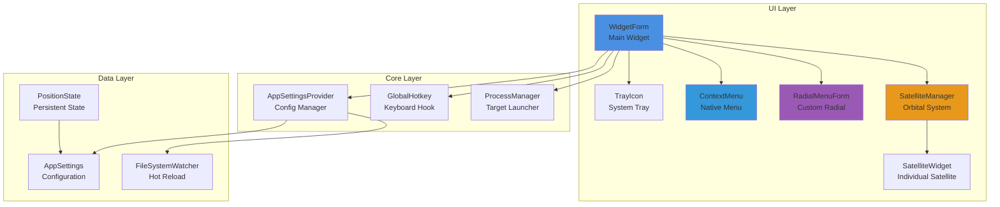
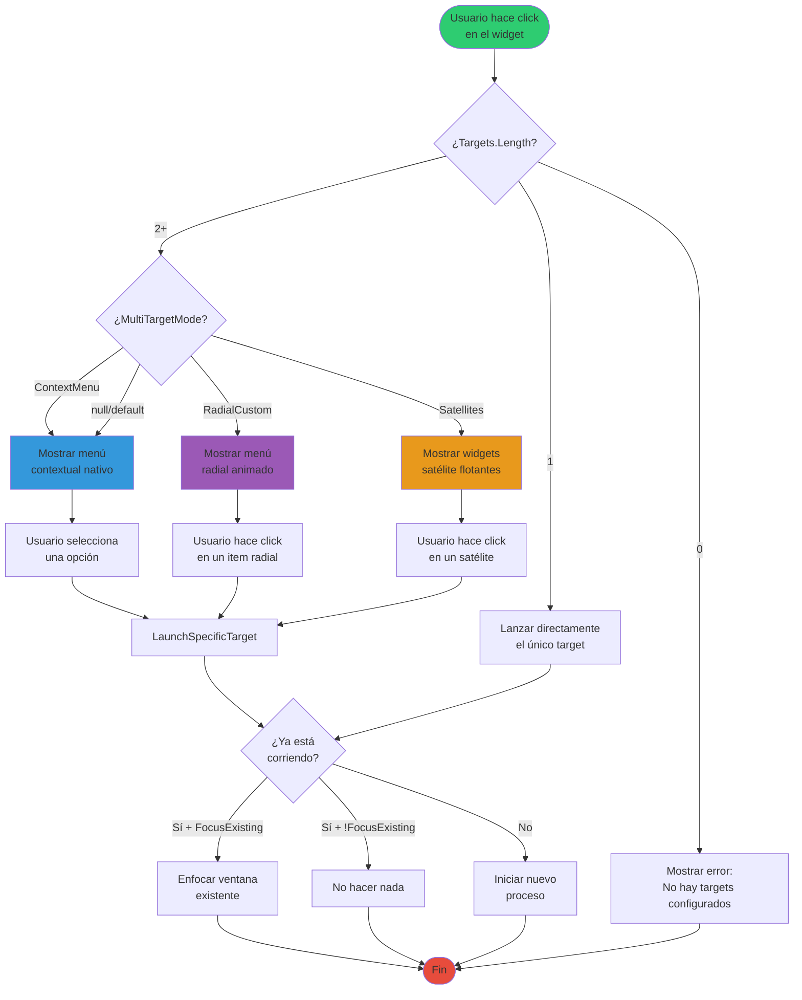
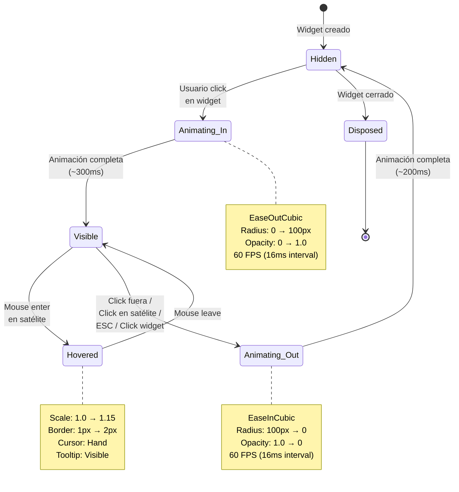
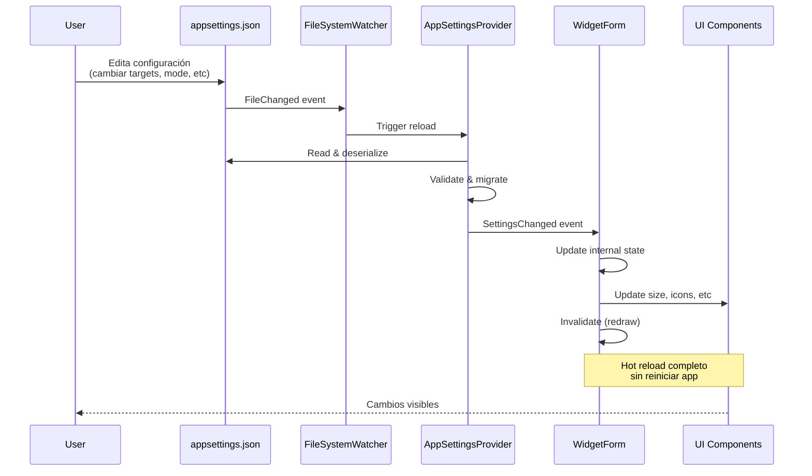
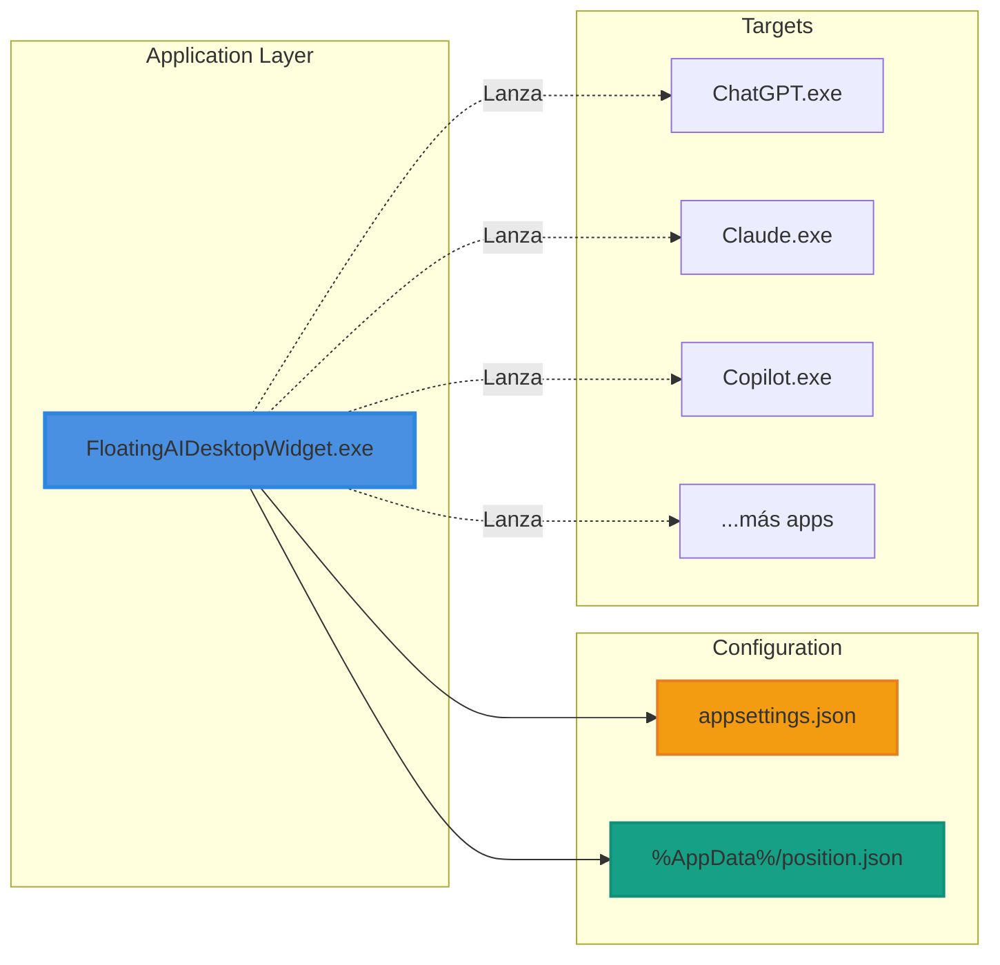

# 🚀 FloatingAIDesktopWidget

<div align="center">

**ES:** Widget flotante inteligente para Windows que permite lanzar múltiples aplicaciones con interfaces visuales espectaculares: menú contextual, menú vertical flotante tipo Syncfusion o widgets satélite animados.

**EN:** Smart floating widget for Windows that launches multiple applications with stunning visual interfaces: context menu, Syncfusion-style vertical floating menu, or animated satellite widgets.


</div>

---

## 📑 Tabla de Contenidos

- [✨ Características](#-características)
- [🎨 Modos de UI Multi-Target](#-modos-de-ui-multi-target)
- [🏗️ Arquitectura](#️-arquitectura)
- [⚙️ Instalación](#️-instalación)
- [📝 Configuración](#-configuración)
- [🎯 Uso](#-uso)
- [📚 Documentación Adicional](#-documentación-adicional)
- [🔧 Desarrollo](#-desarrollo)

---

## 🎯 Escenarios de Uso

### 🔵 Lanzador Simple (1 Target)
- **Configuración**: 1 solo target en `Targets[]`
- **Comportamiento**: Click lanza directamente la aplicación
- **Uso**: Acceso rápido a tu app principal (ChatGPT, Claude, etc.)

### 🟣 Selector Multi-App (2+ Targets)
- **Configuración**: 2 o más targets configurados
- **Comportamiento**: Muestra menú de selección elegante
- **Modos disponibles**:
  - **RadialCustom** (Recomendado) - Menú vertical flotante tipo Syncfusion ✨
  - **Satellites** - Menú vertical con animaciones avanzadas 🌟
  - **ContextMenu** - Menú nativo de Windows (simple)

---

## ✨ Características

### Core Features
- 🎯 **Multi-Target Support** - Lanza múltiples aplicaciones desde un solo widget
- 🎨 **3 Modos de UI** - Menú contextual, Menú vertical flotante, o Satellites animados
- 🖱️ **Draggable & Resizable** - Posición y tamaño persistente
- ⌨️ **Global Hotkey** - Acceso rápido desde cualquier lugar
- 🔄 **Hot Reload** - Cambios en configuración se aplican instantáneamente
- 🌍 **Bilingüe** - Interfaz en Español/English
- 💾 **Gestión de Estado** - Posición guardada en `%AppData%`
- 🎭 **Tray Icon** - Control desde bandeja del sistema
- 🔒 **Single Instance** - No spawns duplicados del widget
- 🎯 **Smart Focus** - Detecta y enfoca aplicaciones ya abiertas

### Advanced Features
- 🌐 **Icon Support** - PNG, JPG, ICO, BMP con rutas relativas/absolutas
- 🎬 **Smooth Animations** - Easing functions para animaciones fluidas
- 📐 **Screen-Aware** - Ajuste automático a bordes de pantalla
- 🎨 **GDI+ Custom Drawing** - Renderizado de alta calidad
- ⚡ **60 FPS Animations** - Animaciones ultra suaves
- 🖼️ **Transparency** - Windows con transparencia real
- 🔧 **Process Management** - Lanza, enfoca y cierra aplicaciones target

---

## 🎨 Modos de UI Multi-Target

Cuando tienes múltiples aplicaciones configuradas (`Targets[]`), el widget ofrece **3 modos visuales diferentes** para seleccionar cuál lanzar:

### Comparación de Modos

| Modo | Descripción | Visual | Mejor Para |
|------|-------------|--------|------------|
| **ContextMenu** | Menú nativo de Windows |  | Simplicidad, familiaridad, muchos items |
| **RadialCustom** | Menú vertical flotante tipo Syncfusion |  | Diseño limpio moderno, 2-8 items |
| **Satellites** | Widgets flotantes animados |  | Máximo impacto visual, 3-6 items |

### 🔵 Modo 1: Context Menu (Native)

```
┌─────────────────────────┐
│ 📱 ChatGPT              │
│ 🤖 Claude Desktop       │
│ 💻 GitHub Copilot       │
│ ──────────────────      │
│ 🔄 Reload settings      │
│ ⚙️  Edit settings       │
└─────────────────────────┘
```

**Características:**
- Menú nativo de Windows
- Ideal para 2-20+ aplicaciones
- Familiaridad inmediata
- Menor impacto visual

**Configuración:**
```json
{
  "UI": {
    "MultiTargetMode": "ContextMenu"
  }
}
```

### 🟣 Modo 2: Vertical Floating Menu (Syncfusion-style)

```
          [Widget]
             ↓
          ┌─────┐
          │  P  │  ← PeopleWorks
          ├─────┤
          │  N  │  ← Notepad
          ├─────┤
          │  C  │  ← Calculator
          ├─────┤
          │  C  │  ← Command Prompt
          └─────┘
```

**Características:**
- ✨ Diseño vertical limpio y moderno (tipo Syncfusion)
- 🎯 Íconos apilados verticalmente con espaciado uniforme
- 🪟 Fondo completamente transparente - efecto flotante
- 📍 Perfectamente alineado con el widget base
- 🔄 Abre hacia **abajo** si estás arriba, hacia **arriba** si estás abajo
- 🎨 Círculos blancos con bordes sutiles y sombras en hover
- 💫 Animación fade in/out suave
- 🔤 Muestra inicial del nombre si no hay ícono configurado
- 📏 Ideal para 2-8 aplicaciones
- 🌟 Diseño elegante y profesional

**Configuración:**
```json
{
  "UI": {
    "MultiTargetMode": "RadialCustom"
  }
}
```

**Comportamiento Inteligente:**
- **Widget en parte superior de pantalla** → Menú se abre hacia **abajo** ⬇️
- **Widget en parte inferior de pantalla** → Menú se abre hacia **arriba** ⬆️
- **Separación automática** → 45px de espacio entre widget y menú
- **Alineación perfecta** → Centrado con el widget base

### 🟠 Modo 3: Satellites (Vertical Animated Widgets)

```
          [Widget]
             ↓
          ┌─────┐
          │  P  │  ← Animación
          ├─────┤     desde
          │  N  │     centro
          ├─────┤     ↑↓
          │  C  │
          ├─────┤
          │  C  │
          └─────┘
```

**Características:**
- 🎯 Widgets flotantes individuales (48px cada uno) apilados verticalmente
- 💫 Animación de expansión suave desde el centro (300ms, ease-out)
- ⚡ Animación de contracción hacia el centro (200ms, ease-in)
- 💬 Tooltips en hover con nombre de aplicación
- 📍 Apilado vertical inteligente (igual que RadialCustom)
- 🔄 Abre hacia arriba/abajo según posición en pantalla
- 🌟 Ideal para 3-6 aplicaciones
- 🎨 **Máximo impacto visual con animaciones**

**Configuración:**
```json
{
  "UI": {
    "MultiTargetMode": "Satellites"
  }
}
```

---

## 🏗️ Arquitectura

### Diagrama de Componentes



### Flujo de Selección Multi-Target



### Ciclo de Vida de Satellites



### Flujo de Hot Reload



---

## ⚙️ Instalación

### Requisitos

- **Sistema Operativo:** Windows 10/11+ (64-bit)
- **Runtime:** .NET Desktop Runtime 9.0+ ([Descargar](https://dotnet.microsoft.com/download/dotnet/9.0))
- **Para desarrollo:** .NET SDK 9.0+

### Build desde el código

```powershell
# Clonar repositorio
git clone https://github.com/peopleworks/FloatingAIDesktopWidget.git
cd FloatingAIDesktopWidget

# Build Release
dotnet build .\FloatingAIDesktopWidget.slnx -c Release

# Ejecutar
.\FloatingAIDesktopWidget\bin\Release\net9.0-windows\FloatingAIDesktopWidget.exe
```

### Instalación Manual

1. Descarga el build desde Releases
2. Extrae en una carpeta (ej: `C:\Program Files\FloatingAIDesktopWidget`)
3. Edita `appsettings.json` con tus aplicaciones
4. Ejecuta `FloatingAIDesktopWidget.exe`
5. (Opcional) Crear acceso directo en Inicio de Windows

---

## 📝 Configuración

### Formato Multi-Target (Nuevo)

```json
{
  "Targets": [
    {
      "Name": "ChatGPT",
      "IconPath": "icons/chatgpt.png",
      "FileName": "C:\\Users\\%USERNAME%\\AppData\\Local\\Programs\\chatgpt\\ChatGPT.exe",
      "Arguments": "",
      "WorkingDirectory": "",
      "RunAsAdministrator": false,
      "SingleInstance": true,
      "FocusExistingIfRunning": true,
      "AllowCloseFromMenu": true
    },
    {
      "Name": "Claude Desktop",
      "IconPath": "icons/claude.png",
      "FileName": "C:\\Users\\%USERNAME%\\AppData\\Local\\Programs\\claude\\Claude.exe",
      "Arguments": "",
      "SingleInstance": true,
      "FocusExistingIfRunning": true
    },
    {
      "Name": "GitHub Copilot",
      "IconPath": "",
      "FileName": "C:\\Program Files\\GitHub Copilot\\GitHubCopilot.exe",
      "SingleInstance": false
    }
  ],

  "UI": {
    "Size": 64,
    "Margin": 16,
    "AlwaysOnTop": true,
    "ShowInTaskbar": false,
    "SnapToEdge": true,
    "Opacity": 1.0,
    "IconPath": "widget-icon.png",
    "Language": "auto",
    "MultiTargetMode": "Satellites"
  },

  "Hotkey": {
    "Enabled": true,
    "Gesture": "Ctrl+Shift+Space"
  }
}
```

### Referencia de Configuración

#### 📋 Targets (Array)

Cada objeto en `Targets[]` representa una aplicación que puedes lanzar:

| Propiedad | Tipo | Descripción | Ejemplo |
|-----------|------|-------------|---------|
| `Name` | `string` | Nombre mostrado en menús | `"ChatGPT"` |
| `IconPath` | `string?` | Ruta a icono (relativa/absoluta/var env) | `"icons/app.png"` o `"C:\\Icons\\app.ico"` |
| `FileName` | `string` | Ejecutable o comando a lanzar | `"notepad.exe"` |
| `Arguments` | `string?` | Argumentos de línea de comandos | `"--debug --port=8080"` |
| `WorkingDirectory` | `string?` | Directorio de trabajo | `"C:\\Projects\\MyApp"` |
| `RunAsAdministrator` | `bool` | Solicitar elevación UAC | `true` / `false` |
| `SingleInstance` | `bool` | Evitar múltiples instancias | `true` / `false` |
| `FocusExistingIfRunning` | `bool` | Enfocar si ya está abierta | `true` / `false` |
| `AllowCloseFromMenu` | `bool` | Permitir cerrar desde menú | `true` / `false` |

**Notas:**
- `IconPath` soporta variables de entorno: `%APPDATA%`, `%USERPROFILE%`, etc.
- Si `IconPath` está vacío o `null`, se muestra la inicial del nombre
- Rutas en Windows deben usar `\\` o `/` (no mezclar)

#### 🎨 UI Settings

| Propiedad | Tipo | Default | Descripción |
|-----------|------|---------|-------------|
| `Size` | `int` | `64` | Tamaño del widget en píxeles |
| `Margin` | `int` | `16` | Margen desde el borde de pantalla |
| `AlwaysOnTop` | `bool` | `true` | Mantener widget siempre visible |
| `ShowInTaskbar` | `bool` | `false` | Mostrar en barra de tareas |
| `SnapToEdge` | `bool` | `true` | Snap a bordes al soltar |
| `Opacity` | `double` | `1.0` | Opacidad (0.0 - 1.0) |
| `IconPath` | `string?` | `""` | Icono del widget principal |
| `Language` | `string` | `"auto"` | `"auto"` / `"es"` / `"en"` |
| `MultiTargetMode` | `string` | `"ContextMenu"` | `"ContextMenu"` / `"RadialCustom"` / `"Satellites"` |

#### ⌨️ Hotkey Settings

| Propiedad | Tipo | Default | Descripción |
|-----------|------|---------|-------------|
| `Enabled` | `bool` | `false` | Activar hotkey global |
| `Gesture` | `string` | `"Ctrl+Shift+Space"` | Combinación de teclas |

**Gestures válidos:**
- `Ctrl+Shift+Space`
- `Ctrl+Alt+F8`
- `Win+Shift+S`
- `Alt+Shift+A`

### Migración desde Configuración Legacy

Si tienes una configuración antigua con `"Target": {...}` (singular), el sistema **automáticamente migra** a `"Targets": [...]` (array) al cargar:

**Antes (Legacy):**
```json
{
  "Target": {
    "FileName": "app.exe"
  }
}
```

**Después (Auto-migrado):**
```json
{
  "Targets": [
    {
      "Name": "app",
      "FileName": "app.exe"
    }
  ]
}
```

---

## 🎯 Uso

### Interacciones Básicas

| Acción | Resultado |
|--------|-----------|
| **Click izquierdo** | Lanza/enfoca aplicación (o muestra menú multi-target) |
| **Click derecho** | Abre menú contextual del widget |
| **Arrastrar** | Mueve el widget (posición se guarda) |
| **Hotkey global** | Activa el widget desde cualquier app |
| **Tray icon** | Menú de control del widget |

### Menú Contextual del Widget

```
┌──────────────────────────┐
│ 📱 Select application... │  ← Lanza app (multi-target)
│ ❌ Close application...  │  ← Cierra app (multi-target)
│ ──────────────────       │
│ 🔄 Reload settings       │  ← Hot reload de config
│ ⚙️  Edit settings        │  ← Abre appsettings.json
│ 🔄 Reset position        │  ← Vuelve a esquina default
│ 🌍 Language              │  ← ES/EN
│ ❌ Exit                  │  ← Cierra el widget
└──────────────────────────┘
```

### Satellites Mode - Interacciones

1. **Click en widget** → Satélites se expanden desde el centro
2. **Hover en satélite** → Tooltip muestra nombre, satélite escala ligeramente
3. **Click en satélite** → Lanza app, satélites se contraen
4. **Click fuera** → Satélites se cierran sin lanzar
5. **ESC** → Satélites se cierran
6. **Click en widget con satélites abiertos** → Cierra satélites

### Vertical Menu (RadialCustom) - Interacciones

1. **Click en widget** → Menú vertical aparece con fade in elegante
2. **Posición automática** → Abre hacia arriba/abajo según ubicación
3. **Hover en item** → Círculo iluminado con sombra y borde azul brillante
4. **Click en item** → Lanza aplicación, menú fade out
5. **Click fuera** → Menú se cierra sin lanzar
6. **ESC** → Menú se cierra
7. **Alineación perfecta** → Centrado con el widget base con 45px de separación

---

## 📚 Documentación Adicional

### Guías Disponibles

- **[ICON_CONFIGURATION_GUIDE.md](ICON_CONFIGURATION_GUIDE.md)** - Guía completa para configurar iconos
  - Formatos de ruta soportados
  - Fuentes de iconos gratuitas
  - Cómo extraer iconos de aplicaciones
  - Resolución de problemas

- **[Documents/floating-ai-desktop-widget-guide.html](Documents/floating-ai-desktop-widget-guide.html)** - Guía interactiva HTML (ES/EN)

- **[TODO.md](TODO.md)** - Roadmap y características planeadas

### Diagramas de Arquitectura



### Estructura de Archivos

```
FloatingAIDesktopWidget/
├── FloatingAIDesktopWidget.exe        # Ejecutable principal
├── appsettings.json                   # Configuración
├── FloatingAIDesktopWidget.dll        # Librería principal
├── icons/                             # Carpeta de iconos (opcional)
│   ├── chatgpt.png
│   ├── claude.png
│   └── copilot.png
├── Documents/
│   └── floating-ai-desktop-widget-guide.html
├── ICON_CONFIGURATION_GUIDE.md
└── README.md

%AppData%/FloatingAIDesktopWidget/
└── position.json                      # Posición persistente
```

---

## 🔧 Desarrollo

### Tecnologías Utilizadas

- **.NET 9.0** - Framework base
- **WinForms** - UI framework
- **GDI+** - Custom drawing & animations
- **System.Text.Json** - Serialización de configuración
- **FileSystemWatcher** - Hot reload
- **Windows API** - Global hotkeys, process management

### Estructura del Proyecto

```
FloatingAIDesktopWidget/
├── AppSettings.cs              # Modelos de configuración
├── AppSettingsProvider.cs      # Provider con hot reload
├── GlobalHotkey.cs             # Global keyboard hooks
├── PositionState.cs            # Estado persistente
├── Strings.cs                  # Localización ES/EN
├── WidgetForm.cs              # Form principal del widget
├── RadialMenuForm.cs          # Menú vertical flotante (RadialCustom)
├── RadialMenuItem.cs          # Item del menú vertical
├── SatelliteManager.cs        # Gestor de satélites (vertical animado)
├── SatelliteWidget.cs         # Widget satélite individual
└── Program.cs                 # Entry point

FloatingAIDesktopWidget.slnx   # Solución
```

### Compilar en Debug

```powershell
dotnet build .\FloatingAIDesktopWidget.slnx -c Debug
```

### Patrones de Diseño Utilizados

- **Provider Pattern** - AppSettingsProvider para configuración
- **Observer Pattern** - Eventos para SettingsChanged, SatelliteClicked
- **Factory Pattern** - Creación de satélites y menú items
- **State Pattern** - Gestión de estados de animación
- **Singleton Pattern** - Global hotkey registration

### Convenciones de Código

- **Naming:** PascalCase para públicos, _camelCase para privados
- **Async:** Métodos async terminan en `Async` (si aplica)
- **Events:** Sufijo `Handler` para event handlers
- **Dispose:** IDisposable implementado en forms y managers

### Debugging Tips

```csharp
// En WidgetForm.cs - Agregar breakpoints en:
- LaunchTarget()              // Lanzamiento de apps
- ShowTargetSelectionMenu()   // Selección de modo UI
- OnSettingsChanged()         // Hot reload

// En SatelliteManager.cs:
- OnAnimationTimer_Tick()     // Ver animaciones frame por frame
- OnSatelliteClicked()        // Detección de clicks
- CalculateTargetPositions()  // Posicionamiento vertical

// En RadialMenuForm.cs (Vertical Menu):
- OnPaint()                   // Ver rendering
- OnMouseMove()               // Hover detection
- ShowAt()                    // Posicionamiento y dirección (arriba/abajo)
- CalculateItemPositions()    // Stack vertical
```

### Testing Multi-Target

1. **Test con 0 targets:** Debe mostrar error
2. **Test con 1 target:** Debe lanzar directamente (sin menú)
3. **Test con 2+ targets:** Debe mostrar menú según `MultiTargetMode`
4. **Test ContextMenu:** Con 2, 5, 10, 20 targets
5. **Test RadialCustom (Vertical Menu):**
   - Con 2-8 targets (óptimo)
   - Widget arriba → menú abre hacia abajo ⬇️
   - Widget abajo → menú abre hacia arriba ⬆️
   - Verificar alineación perfecta con widget base
   - Verificar separación de 45px
   - Verificar fondo transparente
6. **Test Satellites (Vertical Animated):**
   - Con 3-6 targets (óptimo)
   - Animaciones suaves (300ms entrada, 200ms salida)
   - Tooltips funcionando
7. **Test edge cases:** Widget en esquinas, multi-monitor, bordes de pantalla
8. **Test hot reload:** Cambiar mode, targets, iconos en tiempo real
9. **Test animations:** Verificar smooth 60 FPS sin stuttering

---

## 🎬 Animaciones y Efectos

### Easing Functions

```csharp
// SatelliteManager.cs
private static float EaseOutCubic(float t)
{
    return 1 - (float)Math.Pow(1 - t, 3);
}

private static float EaseInCubic(float t)
{
    return (float)Math.Pow(t, 3);
}
```

### Timeline de Animación Satellites

```
0ms     ─────┐ Click en widget
              │
              ├─► Crear satélites en centro
              │   Opacity: 0
              │   Radius: 0
              │
16ms    ─────┤ Frame 1
              │ Progress: 5.3%
              │ Radius: 5.3px (eased)
              │
32ms    ─────┤ Frame 2
              │ Progress: 10.6%
              │
...     ─────┤ ...frames intermedios...
              │
300ms   ─────┤ Frame final
              │ Progress: 100%
              │ Radius: 100px
              │ Opacity: 1.0
              └─► Animación completa
                  Timer detenido
```

### Performance

- **60 FPS** animaciones (16.67ms interval)
- **Double buffering** para evitar flicker
- **Invalidate** solo regiones necesarias
- **Dispose** de recursos GDI+ inmediato
- **Timer** detenido cuando no anima

---

## 🐛 Resolución de Problemas

### El widget no aparece

- ✅ Verifica que .NET 9.0 Runtime esté instalado
- ✅ Revisa que `UI.AlwaysOnTop = true`
- ✅ Intenta `Reset position` desde tray icon
- ✅ Verifica que no esté oculto detrás de otra ventana

### Los iconos no se muestran

- ✅ Verifica que `IconPath` sea correcto
- ✅ Comprueba que el archivo existe
- ✅ Usa formato soportado: PNG, JPG, ICO, BMP
- ✅ Consulta [ICON_CONFIGURATION_GUIDE.md](ICON_CONFIGURATION_GUIDE.md)

### Hotkey no funciona

- ✅ Verifica `Hotkey.Enabled = true`
- ✅ Comprueba que no haya conflicto con otra app
- ✅ Intenta otra combinación de teclas
- ✅ Ejecuta como Administrador si el target lo requiere

### Satélites se salen de pantalla

- ✅ Asegúrate de tener la última versión (con screen bounds fix)
- ✅ El sistema ajusta automáticamente a `WorkingArea`
- ✅ Reporta issue si ocurre en multi-monitor

### Hot reload no funciona

- ✅ Guarda el archivo `appsettings.json`
- ✅ Espera 200ms (debounce)
- ✅ Revisa que el JSON sea válido (usa linter)
- ✅ Usa menú "Reload settings" manualmente

---

## 📄 Licencia

MIT License - Ver archivo LICENSE para detalles.

---

## 🤝 Contribuir

Las contribuciones son bienvenidas! Por favor:

1. Fork el proyecto
2. Crea una feature branch (`git checkout -b feature/AmazingFeature`)
3. Commit tus cambios (`git commit -m 'Add some AmazingFeature'`)
4. Push a la branch (`git push origin feature/AmazingFeature`)
5. Abre un Pull Request

---

## 🎯 Roadmap

Ver [TODO.md](TODO.md) para features planeadas.

**Próximas características:**
- [ ] Installer automático (WiX/NSIS)
- [ ] Auto-start con Windows (registro)
- [ ] Themes customizables (colores, gradientes)
- [ ] Plugins system
- [ ] Multi-widget support (múltiples widgets flotantes)

---

## 👨‍💻 Autores

- **PeopleWorks** - *Initial work & Multi-Target System*

**Co-Authored-By:**
- Claude Sonnet 4.5 (Anthropic AI Assistant)

---

## 🙏 Agradecimientos

- **Syncfusion** por la inspiración del diseño vertical flotante limpio y moderno
- **DevExpress** por los conceptos de menús visuales interactivos
- La comunidad **.NET** por las excelentes herramientas y frameworks
- Todos los usuarios que reportan issues y sugieren mejoras

---

<div align="center">

**¿Te gusta el proyecto? ⭐ Dale una estrella!**


</div>
